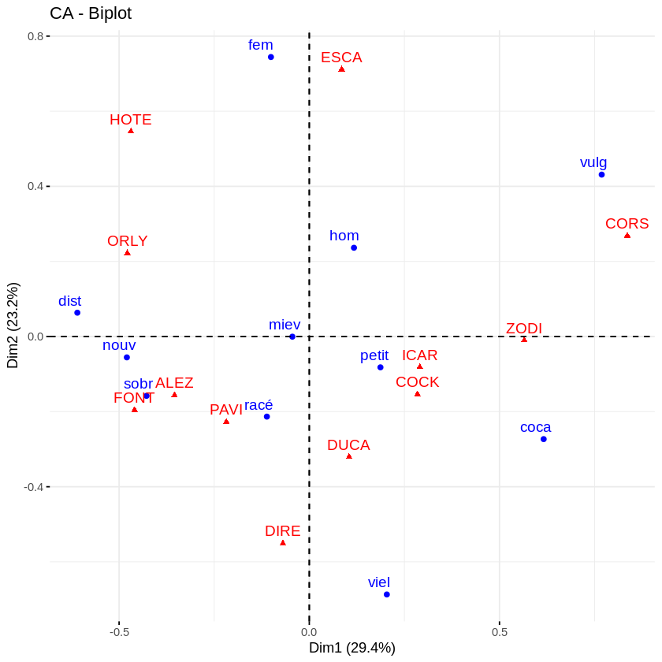

# ENQUETE DE LA REGIE FRANCAISE DES TABACS

Cette étude de cas est extraite de l'ouvrage de J.P. Benzecri "Analyse des données. Tome 2: l'analyse des
correspondances". Une enquête a été effectuée auprès de cent fumeurs afin de choisir les noms de deux
nouvelles marques de cigarettes. La première marque est destinée à une clientèle à une clientèle masculine:
l'homme ciblé est un connaisseur distingué, raffiné mais viril, de niveau socio-économique élevé. La seconde
vise un public féminin, élégant, assuré, dynamique.

Douze marques possibles ont été retenues:
I = {Orly (ORLY), Alezan (ALEZ), Corsaire (CORS), Directoire (DIRE), Ducat (DUCA), Fontenoy (FONT),
Icare(ICAR), Zodiac(ZODI), Pavois (PAVI), Cocker(COCK), Escale (ESCA), Hôtesse (HOTE)}.
Pour évaluer leur image auprès du public , onze attributs ont été proposés aux fumeurs:
J = {Vieillot-désuet (viel), Nouveau-Riche(Nouv), Sobre-élégant(Sobr), Cocasse-Ridicule(Coca), Racé (racé),
Mièvre(miev), Distingué(dist), Vulgaire-Commun (vulg), Pour un Homme (hom), Pour une femme (fem), Pour
une petite nature (petit)}.
